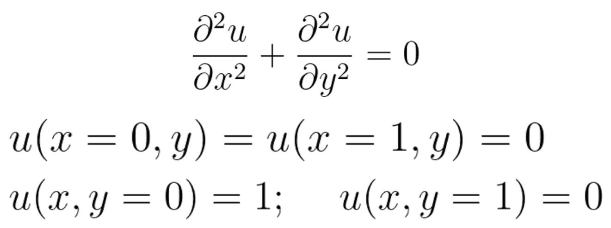

## Laplace equation:  

  - solve the Laplace equation using CUDA.

  - draw the heatmap of the solution u(x,y) using anything you want.

Here are the equation and the boundary conditions.

A good explanation of how to discretize the Laplace equation is given [here](https://www.public.asu.edu/~hhuang38/pde_slides_numerical_laplace.pdf) (starting from page 3). In principle you can use any of the 3 approaches:

  - discretize the equation and get (NM)^2 sparse linear system and inverse the matrix;

  - discretize the equation and get (NM)^2 sparse linear system and solve it iteratively;

  - try to achieve the steady-state solution of the corresponding heat equation with some initial conditions (replace 0 with du/dt).

## Filtering:

Take an arbitrary image and apply two types of filters to it using CUDA.

  - Blurring filter (have at least 2 blurring filters - they can differ in stencil size or the values of the filter matrix for example).

  - Median filter (try to achieve the cartoonish effect).

## Histogram:

You need to plot a  histogram for a chosen picture. For this purpose:

  - take any picture -> grayscale it -> calculate the histogram for the picture using CUDA.

  - plot the resulting histogram using anything you want.
