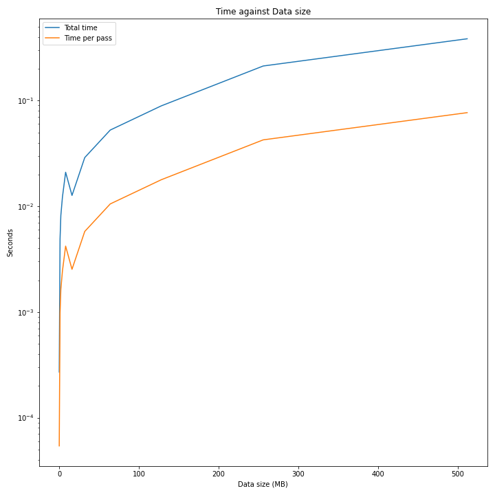

## Ping-Pong

1. Let's imagine that processes are human beings and they wanted to play ping-pong to get acquainted with each other. Processor 0 starts the play. It randomly passes a ball to 'i' and says its name.

Processor 'i' passes a ball to another guy 'j' saying all previous names in the mentioned order and says its own name. Passing occurs randomly; it means only processor 'i' knows who will be next, others don't know and they always need to be on the lookout. The game ends after N passes. Use the synchronous mode MPI_Ssend to send the data. (5 points)

2. Then slightly modify the program. Now the processes just send the data with fixed length instead of sending all the previous names. Insert timing calls to measure the time taken by all the communications. You will need to time many ping-pong iterations to get a reasonable elapsed time, especially for small message lengths.

  - Investigate how the time taken varies with the size of the message.

All measurements were conducted with **3 processes** and **5 passes**.

  - Plot a graph of time against message size to determine the latency (i.e. the time taken for a message of zero length).

  - Plot a graph of the bandwidth to see how it varies with message size.

## Cellular Automata 1-d

First: you initialize the one-dimensional array with ones and zeros (either randomly or not)

Second: you update the values in a cell according to the cell's current value and the left and right neighbors' current values.

So, the next state of the cell depends on the current state of 3 cells only.

  - Implement both periodic and constant boundary conditions.

  - Implement both periodic and constant boundary conditions.

  - Value updates can be parallelized if you divide the computational domain into chunks and allocate them to different processes.

  - Use ghost cells to send and receive values at interfaces between the two processes.

  - Design a program in such a way that any kind of rule can be easily inputted into the computations.

  - Draw the pictures of 3 interesting rule outputs

  - Make a graph that shows the speedup.

Speedup Graph for **array size 1.000.000** and **500 iterations**.

